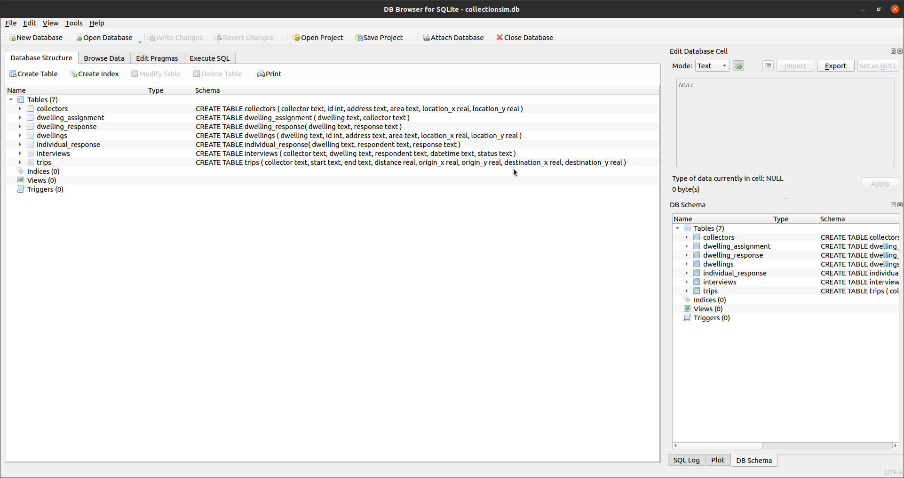
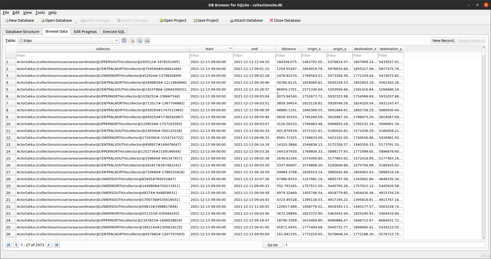

# Household Collection Simulation using Akka

This repository contains a rough agent-based simulation of a household survey using [Akka](https://akka.io).  Akka is an actor system implementation for the JVM.  A more detailed slideshow can be found in teh `doc` subdirectory of this repository.

## Installation

The project is written in Scala and requires [sbt](https://www.scala-sbt.org/) to be built.  Simply run:

```bash
sbt assembly
```

which will create a fat jar in the folder:

```plaintext
target/scala-2.13/collectionsim.jar
```

## Usage

The fat jar can be used as a library, but a simple entry-point is provided.  Command-line options can be assessed as follows:

```bash
java -cp target/scala-2.13/collectionsim.jar org.cmhh.Main --help
```
```plaintext
version 0.1.0-SNAPSHOT
  -d, --db-path  <arg>            name of output sqlite database
  -i, --input-collectors  <arg>   path to input file containing collectors
      --input-dwellings  <arg>    path to input file containing dwellings
  -n, --num-days  <arg>           number of consecutive days to simulate
  -s, --start-datetime  <arg>     datetime respresenting the start time of the
                                  simulation
  -w, --wait-interval  <arg>      time (in milliseconds) to wait between each
                                  simulated day
  -h, --help                      Show help message
  -v, --version                   Show version of this program
```

Some sample inputs are provided in the `data` folder as follows (to save space, these are all gzipped, but uncompressed csv files can be used also):

file                  | description
----------------------|------------
`interviewers.csv.gz` | A sample of 100 addresses to be used as interviewer locations.
`sample1.csv.gz`      | A sample of 20000 addresses, drawn from a random set of nearly 2000 meshblocks, to be used as a dwelling sample.
`sample2.csv.gz`      | A sample of 20000 addresses to be used as a dwelling sample.
`sample1_nn.csv.gz`   | `sample1.csv.gz` contains 13 groups of roughly equal size, so `nn` can be any of `01` through `13`.
`sample2_nn.csv.gz`   | `sample2.csv.gz` contains 13 groups of roughly equal size, so `nn` can be any of `01` through `13`.

So, for example, we could run:

```bash
java -cp target/scala-2.13/collectionsim.jar org.cmhh.Main \
  --db-path collectionsim.db \
  --input-collectors data/interviewers.csv.gz \
  --input-dwellings data/sample1_01.csv.gz \
  --start-datetime "2021-12-13 09:00:00" \
  --num-days 7
```

This will produce a SQLite database named `collectionsim.db` which can be opened in the usual way.  For example, with sqlitebrowser:





The repository contains two test databases, `collectionsim1.db` and `collectionsim2.db`, which are the result of running a simulation with `data/sample1_01.csv.gz` and `data/sample2_01.csv.gz` as inputs, respectively--so one clustered, and the other unclustered.  We could query these in R:

```r
library(RSQLite)

db1 <- dbConnect(RSQLite::SQLite(), "collectionsim1.db")
db2 <- dbConnect(RSQLite::SQLite(), "collectionsim2.db")

kms1 <- DBI::dbGetQuery(db1, "select sum(distance) / 1000 from trips")
kms2 <- DBI::dbGetQuery(db2, "select sum(distance) / 1000 from trips")

as.numeric(kms2 / kms1)

DBI::dbDisconnect(db1)
DBI::dbDisconnect(db2)
```
```plaintext
[1] 1.442284
```

More examples to come...
