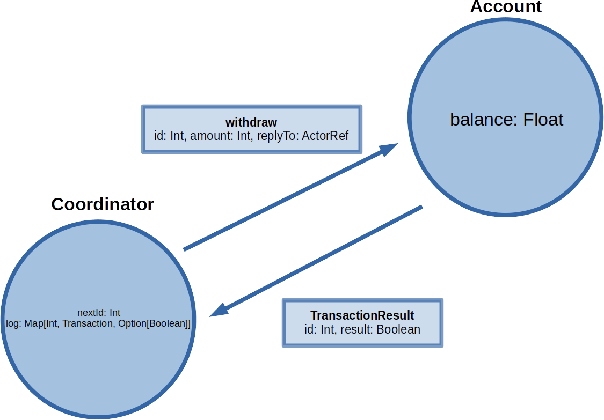
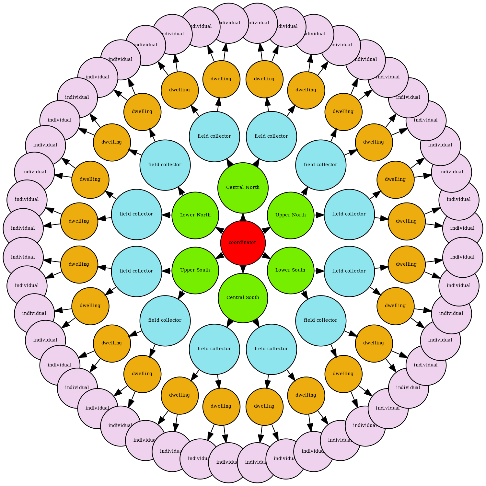
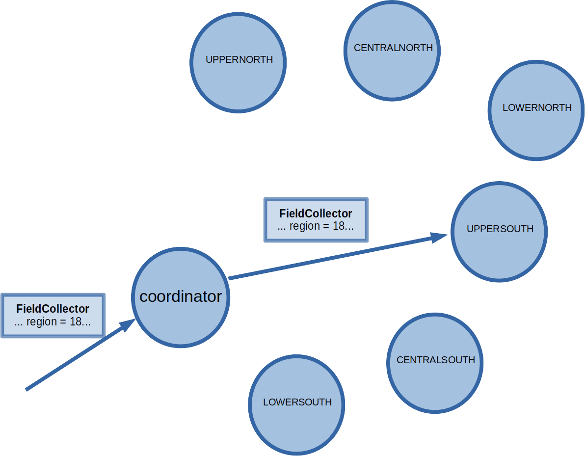
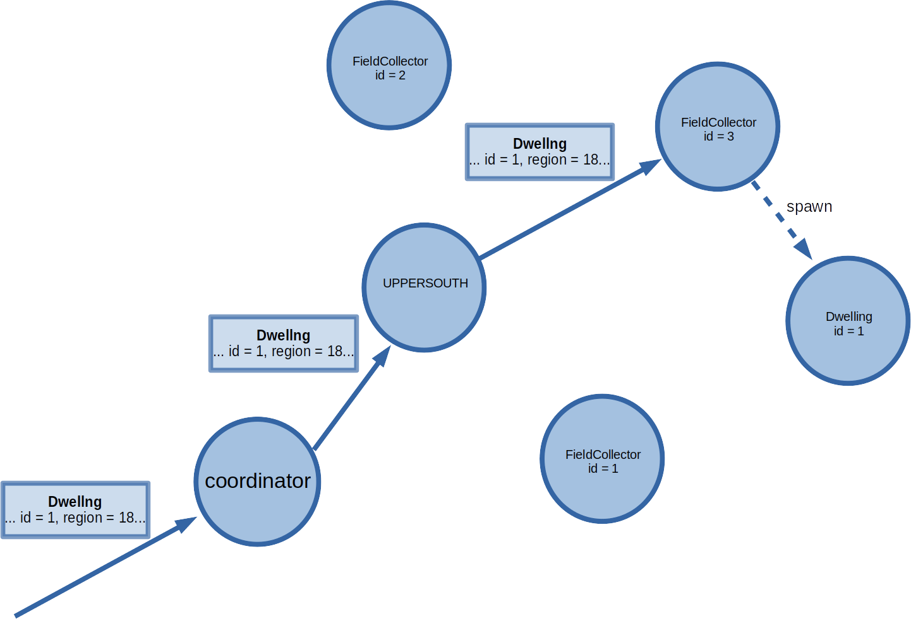
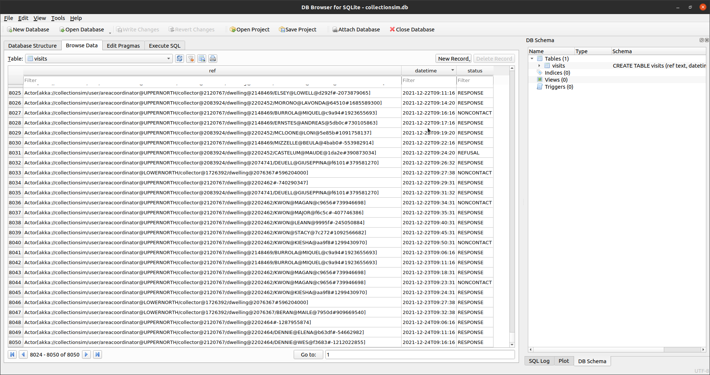

<style scoped>
h1, h2 {
  color: #000000;
  padding: 0;
  margin: 0;
  text-align: center;
}
</style>


# Agent-based Simulations with the Actor Model
## with application to household collections

----

# But first, let's talk about concurrency...

----

A canonical example used to illustrate common concurrency pitfalls is that of a simple bank account.  Consider the following...

----

```scala
class Account(val name: String, private var balance$: Float) {
  def balance: Float = balance$

  def withdraw(amount: Float): Try[Unit] = Try {
    if (balance$ >= amount) {
      val newbalance = balance$ - amount
      Thread.sleep(scala.util.Random.nextInt(10))
      balance$ = newbalance 
    } else throw new Exception("Insufficient funds.")
  }

  def deposit(amount: Float): Unit = {
    val newbalance = balance$ + amount
    Thread.sleep(scala.util.Random.nextInt(10))
    balance$ = newbalance
  }

  override def toString: String = f"$name: $$${balance$}%.2f."
}
```

----

Seems okay...

```scala
scala> val me = new Account("Chris", 1)
val me: Account = Chris: $1.00.

scala> me.deposit(1); me.withdraw(1); println(me)
Chris: $1.00.
```

----

In a concurrent setting, though, this implementation is extremely problematic.  This is because neither `withdraw` nor `deposit` are _atomic_&ndash;if a withdrawal and deposit are executed simultaneously, the individual statements will be interleaved in a non-deterministic way...

----

```scala
def test: Unit = {
  val account = new Account("Chris", 1)

  val t1 = new Thread {
    override def run(): Unit = {
      account.withdraw(1)
    }
  }

  val t2 = new Thread {
    override def run(): Unit = {
      account.deposit(1)
    }
  }

  t1.start()
  t2.start()
  t1.join()
  t2.join()

  println(account)
}
```

----

<style scoped>
table {
  font-size: 60%
}
</style>

If you're _lucky_, this _might_ happen...

thread 1                             | thread 2                             | `newbalance:1` | `newbalance:2` | `balance$`
-------------------------------------|--------------------------------------|----------------|----------------|-----------:
`val newbalance = balance$ - amount` |                                      | $0.00          |                | $1.00
`balance$ = newbalance`              |                                      | $0.00          |                | $0.00
&nbsp;                               | `val newbalance = balance$ + amount` |                | $1.00          | $0.00
&nbsp;                               | `balance$ = newbalance`              |                | $1.00          | $1.00

----

<style scoped>
table {
  font-size: 60%
}
</style>

But this could happen...

thread 1                             | thread 2                             | `newbalance:1` | `newbalance:2` | `balance$`
-------------------------------------|--------------------------------------|----------------|----------------|-----------:
`val newbalance = balance$ - amount` |                                      | $0.00          |                | $1.00
&nbsp;                               | `val newbalance = balance$ + amount` | $0.00          | $2.00          | $1.00
`balance$ = newbalance`              |                                      | $0.00          | $2.00          | $0.00
&nbsp;                               | `balance$ = newbalance`              |                | $2.00          | $2.00

----

<style scoped>
table {
  font-size: 60%
}
</style>

...or this...

thread 1                             | thread 2                             | `newbalance:1` | `newbalance:2` | `balance$`
-------------------------------------|--------------------------------------|----------------|----------------|-----------:
`val newbalance = balance$ - amount` |                                      | $0.00          |                | $1.00
&nbsp;                               | `val newbalance = balance$ + amount` | $0.00          | $2.00          | $1.00
&nbsp;                               | `balance$ = newbalance`              | $0.00          | $2.00          | $2.00
`balance$ = newbalance`              |                                      | $0.00          | $2.00          | $0.00

----

```scala
scala> (1 to 10).foreach(i => test)
```
```plaintext
Chris: $0.00.
Chris: $2.00.
Chris: $2.00.
Chris: $0.00.
Chris: $0.00.
Chris: $1.00.
Chris: $2.00.
Chris: $2.00.
Chris: $2.00.
Chris: $0.00.
```

----

One common 'fix' is to make things atomic by using a _monitor_ or _lock_:

```scala
class Account2(val name: String, private var balance$: Float) {
  def balance: Float = balance$

  def withdraw(amount: Float): Try[Unit] = Try {
    this.synchronized {
      if (balance$ >= amount) {
        val newbal = balance$ - amount
        Thread.sleep(scala.util.Random.nextInt(10))
        balance$ = newbal 
      } else throw new Exception("Insufficient funds.")
    }
  }

  def deposit(amount: Float): Unit = {
    this.synchronized {
      val newbal = balance$ + amount
      Thread.sleep(scala.util.Random.nextInt(10))
      balance$ = newbal
    }
  }

  override def toString: String = f"$name: $$${balance$}%.2f."
}
```

----

One analogy I remember from lectures goes like this... 

Think of `this` as a locked room for which there is a single key.  Think of synchronized blocks as workers who can only do their job when inside the room.  A single worker uses the key to enter the room, and they make sure they lock up on the way out.  Importantly, we make sure that mutable variables, like `balance$`, are inside the room.

The analogy can get a little tortured, with people climbing in windows and so forth, but principled use of patterns like this can be used to good effect.

----

The important point, though, is that ensuring correctness and safety of concurrent programs requires considerably more effort than purely sequential approaches.  It can be quite difficult in practice, and figuring it all out can be a source of significant cognitive load.

----

# The Actor Model

----

From [Wikipedia](https://en.wikipedia.org/wiki/Actor_model):

> The actor model in computer science is a mathematical model of concurrent computation that treats _actors_ as the universal primitive of concurrent computation. In response to a message it receives, an actor can: make local decisions, create more actors, send more messages, and determine how to respond to the next message received. Actors may modify their own private state, but can only affect each other indirectly through messaging (removing the need for lock-based synchronization).

----

[Akka](https://akka.io) provides an implementation of the actor model on the JVM which adheres faithfully to this definition.  A collection of actors exist in a single _context_ which is referred to as an _actor system_.

While actors are free to send messages to any other actor, we often set things up in a heirarchical fashion.  We will commonly have a single coordinator which will spawn a set of actors, each of which might spawn yet another set of actors, and so on.  Each actors will then act as a broker of sorts, receiving messages from the actor above them in the heirarchy, and forwarding them on to a subordinate as appropriate.

----

In Akka, each actor has a mailbox where messages are stored, typically implemented as a queue or a similar data structure.  Akka will ensure certain delivery guarantees hold, such as ensuring every message is delivered exactly once, and that messages stay in the correct order.  

Mailboxes will usually have a fixed size, and so _can_ overflow if messages are sent faster than they can be processed.  Messages sometimes can't be delivered for other reasons, and we refer to such messages as _dead letters_.  Where possible, these are routed to a synthetic actor called `/deadLetters`.  Actors can subscribe to a dead letter service, though this is intended mostly for debugging, as opposed to error-recovery.

----

An account is modelled as an actor with an internal balance, and we signal our intention to withdraw or deposit funds by sending simple messages.  The messages themselves are anything that can be serialized, but we typically use simple data objects such as case objects or case classes.  Actors process messages as they arrive, one-by-one, and in the order received.  

That is, a single actor will not process transactions concurrently.  But a system can contain an arbitrary nubmer of actors, all of which are free to send and process messages completely independently of each other, and so the system as a whole will be highly concurrent.  

----

```scala
object AccountActor {
  sealed trait Transaction
  case class Withdraw(amount: Float, replyTo: ActorRef[Any]) extends Transaction
  case class Deposit(amount: Float, replyTo: ActorRef[Any]) extends Transaction
  case class Balance(replyTo: ActorRef[Any]) extends Transaction

  def apply(name: String, balance: Float): Behavior[Transaction] = Behaviors.receive{(context, message) => {
    message match {
      case m: Withdraw =>
        if (balance >= m.amount) {
          m.replyTo ! true
          val bal = balance - m.amount
          context.log.info(f"Withdrew $$${m.amount}%.2f, balance: $$$bal%.2f...")
          apply(name, bal)
        } else {
          context.log.info(f"Insufficient funds - balance: $$$balance%.2f, amount: $$${m.amount}%.2f...")
          m.replyTo ! false
          Behaviors.same
        }
      case m: Deposit =>
        m.replyTo ! true
          val bal = balance + m.amount
          context.log.info(f"Deposited $$${m.amount}%.2f, balance: $$$bal%.2f...")
        apply(name, bal)
      case m: Balance =>
        m.replyTo ! f"${name}: $$$balance%.2f"
        Behaviors.same
    }
  }}
}
```

----

As noted above, when using Akka, we typically create a so-called actor system consisting of many actors arranged in a heirarchy.  For the sake of simplicity, though, we can create a system consisting of just the one account in this case:


```scala
val account = ActorSystem(AccountActor("Chris", 1), "chris")
```

----

There are two main patterns for interacting with actors&ndash;_tell_ (fire and forget) and _ask_ (request-response).  In the first case, we send a message and then carry on.  For example, to deposit and withdraw:

```scala
account ! Withdrawal(1)
account ! Deposit(1)
```

The second is considerably more complicated, but one variant is to send a message and immediately capture the result as a `Future`:

```scala
val f: Future[Any] = actor ? message
```

We can await the result of a future if that is required to decide what to do next:

```scala
val result: String = Await.value(f, 5.seconds)
```

----

```scala
(1 to 5).foreach(i => {
  me ! Deposit(1)
  me ! Withdraw(1)
})

me ! Balance
```
```plaintext
14:05:33 INFO  AccountActor$:25 - Deposited $1.00, balance: $2.00...
14:05:33 INFO  AccountActor$:17 - Withdrew $1.00, balance: $1.00...
14:05:33 INFO  AccountActor$:25 - Deposited $1.00, balance: $2.00...
14:05:33 INFO  AccountActor$:17 - Withdrew $1.00, balance: $1.00...
14:05:33 INFO  AccountActor$:25 - Deposited $1.00, balance: $2.00...
14:05:33 INFO  AccountActor$:17 - Withdrew $1.00, balance: $1.00...
14:05:33 INFO  AccountActor$:25 - Deposited $1.00, balance: $2.00...
14:05:33 INFO  AccountActor$:17 - Withdrew $1.00, balance: $1.00...
14:05:33 INFO  AccountActor$:25 - Deposited $1.00, balance: $2.00...
14:05:33 INFO  AccountActor$:17 - Withdrew $1.00, balance: $1.00...
14:05:33 INFO  AccountActor$:28 - Chris: $1.00
```

----

# Modelling a System

----

While it would be disingenuous to claim that it is easy to program a complete actor system from scratch, I would argue that the general _functionality_ is nevertheless _conceptually_ straightforward, and we certainly can (and should) describe our actor system completely before ever writing a single line of code.

----

<style scoped>
img {
  display: block;
  margin: auto;
  max-height: 80%;
  max-width: 80%
}
</style>



----

In this case, a transaction request is sent with a unique ID.  At the same time, the requestor stores a record of the request, along with the ID, in a list of pending transactions.  When the receiving account actions the request, a message is sent back to the requestor with the original ID and a value indicating whether the transaction was successful or not.  The requestor can pair the response with the original request via the ID, and take any action that was dependent on the result.

Another approach would be to use the ask pattern&ndash;we send the request and wait for the response before proceeding.  But this particular example demonstrates that, with a little thought, we don't need to.  Rather than wait for a response, we just 'remember' what we need to do when the response does finally arrive, and we carry on working on other things in the meantime.

----

# Modelling a Household Collection

----

Now let us consider how we might imagine a household collection as an actor system.  We'll simplify a fair bit, but at a high level we have the following actors:

- a single coordinator, `Coordinator`
- a handful of areal-level coordinators, `AreaCoordinator`
- a set of field collectors, `FieldCollectorActor`
- a set of cases / dwellings / addresses, `DwellingActor`
- a set of dwelling residents, `IndividualActor`

The system is strictly heiararchical, with actors in the list being spawned by the actors immediately preceeding them in the list...

----


# Topology

----

<style scoped>
img {
  display: block;
  max-width: 60%;
  margin-left: auto;
  margin-right: auto;
}
</style>



----


# Create a system / Coordintor

----

To start, we create an actor system. This is easy enough:

```scala
val system = ActorSystem(Coordinator(), "collectionsim")
```

At this point, the system is relatively useless since the coordinator has no other actors to send messages to.  Still, it is exclusively through the coordinator that we will communicate with other actors in the system&ndash;we will send messages to the coordinator, and the coordinator will forward them as required.

----


# Area coordinators

----

Actually, the main coordinator spawns a set of area coordintors as part of its own setup:

```scala
val areaCoordinators: Map[Area, ActorRef[AreaCoordinatorCommand]] = 
  area.areas.map(x => {
    (x, context.spawn(AreaCoordinator(), s"areacoordinator@${x.toString}"))
  }).toMap
```

where the areas are:

```scala
object area {
  val areas = List(
    UPPERNORTH, CENTRALNORTH, LOWERNORTH, 
    UPPERSOUTH, CENTRALSOUTH, LOWERSOUTH
  )
}
```

----


# Field collectors

----

<style scoped>
img {
  display: block;
  margin: auto;
  max-width: 75%;
}
</style>



----

Here, collectors are simply a random sample taken from [LINZ NZ street address](https://data.linz.govt.nz/layer/53353-nz-street-address/), saved as a CSV file, then parsed one-by-one on start-up.  But the idea, though, is that we could fix everything else in the system and run simulations with differing sets of collectors (more or fewer, with specific placements, etc) in order to see how things change.

----


# Cases / Dwellings

----

<style scoped>
img {
  display: block;
  margin: auto;
  max-width: 80%;
}
</style>



----

Here, the dwellings are sourced from a CSV and fed to the system one-by-one in exactly the same way as the field collectors.  So, again, we can trial different sets of cases and observe the results.  For example, we could draw two samples of equal size, one clustered, and one not, and see how this affects, for example, the total amount of kilometers travelled by field collectors.

----

There are two processes of note when spawning a new dwelling:

- choosing which field collector will spawn the dwelling
- deciding what type of dwelling will be spawned

----

Each area coordinator remembers which collectors it has spawned, including the location of each.  It also remembers which dwellings it has forwarded on, and to whom.  There are any number of ways we could choose to assign cases to collectors, but here the logic is quite simple:

- subset collectors to the set with fewer than $n$ cases assigned
- from the remaining set, choose the collector with the shortest drive-time to the case

Note that drive time is determined by calling a local [web service](http://project-osrm.org/).  If the web service does not respond fast enough (or at all), drive time is estimated as the time required to drive 1.35 times the Euclidean distance at some fixed speed (defaults to 60km/h).

----

<style scoped>
div.iframe-container {
  height: 100%;
  width: 100%!important;
}

iframe {
  display: block;
  height: 133%;
  width: 133%;
  border: 1px solid black;
  -ms-zoom: 0.75;
  -moz-transform: scale(0.75);
  -moz-transform-origin: 0 0;
  -o-transform: scale(0.75);
  -o-transform-origin: 0 0;
  -webkit-transform: scale(0.75);
  -webkit-transform-origin: 0 0;
}
</style>

<!--<iframe src="https://cmhh.hopto.org/osrm-frontend"></iframe>-->
<div class=iframe-container>
<iframe src="http://localhost:9966"></iframe>
</div>

----

Each dwelling that is spawned will go on to spawn a random collection of individuals.  A proportion of dwellings will remain empty (0.1), but for the rest we first choose a random household type from the following set: 

- one person household 
- one family household 
- two family household
- other multi-person household

----

Then, for each family, we then decide a family type from the following set:

- couple only
- couple only and others
- couple with children
- couple with children and others
- one parent with children
- one parent with children and others

----

There are functions for generating random names and birthdates, and these are used to generate adults and children as appropriate.

There is a function for generating a random couple.  It is a rough stand-in for now, just generating a male and female with a shared surname, and randomly chosen ages within $\pm5$ years of each other.

The number of children or others to add where required is chosen randomly from the ranges $[1,4]$ and $[1,2]$, respectively.

----

# The Simulation

----

We run the simulation one day at a time, and we do this by simply passing the coordinator a message as follows:

```scala
system ! RunDay(java.time.LocalDateTime.of(2021, 12, 14, 9, 0))
```

This message is propogated to all the way to each field collector, each of which then simulates a days work before awaiting then next message.

----

At a high level, each field collector runs the following process:

1. subset assigned cases to the set that are incomplete
2. call a routing service to place cases in the most efficient order
3. determine estimated time of arrival to the next case, `eta`
4. send the next case a request to interview, including `eta`
5. react as appropriate to any messages received
6. repeat steps 3 to 5 until it is time to return home for the day  

----

When a case rejects a request for an interview, we add some small amount of time, 1 or 2 minutes, say, before carrying on.

When a case accepts a request for an interview, the dwelling itself will send a payload representing a completed questionnaire, along with some randomly generated duration which is added to the current time.  It will then also send the references for each individual in the dwelling, and the collector will then send a request to interview to each in a sequential fashion.

----

As for a dwelling, if an individual rejects a request to interview, we add some small amount of time before carrying on.

When an individual accepts a request for an interview, the individual will also send a payload representing a completed questionnaire, along with some randomly generated duration which is added to the current time.

----

This logic is overly simplistic, being for demonstrative purposes only, and could be extended.  For example, we might allow cases to schedule appointments, and this would affect the ordering of cases, as well as possibly affecting the likelihood of success.  Similarly, the probability of accept / reject is fixed, but since we pass the time we expect to start the interview with each request, the probability of acceptance could just as well be conditioned on the time.  We could even allow dwellings and individuals to reply with a telephone number so that future contacts could be by phone and involve no travel.

----

And that's it!

----

# Saving the Results

----

There are roughly a zillion different patterns we could employ to collect information generated by our system.  In this case, however, we have a single special actor called `eventRecorder`, and actors will generally send any information we wish to keep directly to it.  Internally, `eventRecorder` maintains an SQLite database

If this were a real-time system, we might instead choose to send data to a proper event log, such as provided by Apache Kafka.  But here our events won't be correctly ordered, and so this is perhaps less useful in a simulation setting.  For example, an event claimed to be emitted at 10am by collector 1 is not guaranteed to occur in real-time before an event claimed to be emitted at 11am by collector 2.

----

